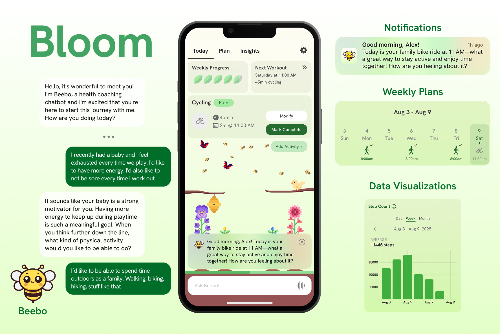

# Bloom

Bloom is an iOS application for physical activity promotion developed by researchers at Stanford University. The app integrates an LLM-based health coaching chatbot with UI-based interactions such as activity tracking, push notifications, data visualizations, and a garden-based ambient display.

This repository contains all code for the Bloom application and accompanies our publication:
> **Bloom: Designing for LLM-Augmented Behavior Change Interactions.** Matthew Jörke, Defne Genç*, Valentin Teutschbein*, Shardul Sapkota, Sarah Chung, Paul Schmiedmayer, Maria Ines Campero, Abby C. King, Emma Brunskill, James A. Landay. 2025.  [https://arxiv.org/abs/2510.05449](https://arxiv.org/abs/2510.05449)  *equal contribution.

Please file a [GitHub issue](https://docs.github.com/en/issues/tracking-your-work-with-issues/learning-about-issues/quickstart) for any bugs or issues. For any further questions, contact Matthew Jörke (joerke@stanford.edu).

## Table of Contents
- [Quickstart](#quickstart)
- [Project Overview](#project-overview)
- [Setup & Configuration](#setup--configuration)
- [Licensing](#licensing)
- [Contributing](#contributing)
- [Acknowledgements](#acknowledgements)

## Quickstart
This section provides a brief overview to get the app running locally. For further details, see [Setup & Configuration](#setup--configuration).

1. Follow the [React Native environment setup instructions](https://reactnative.dev/docs/set-up-your-environment) for macOS as your development OS and iOS as your target OS. Skip the [Optional] section.

2. Install [conda](https://www.anaconda.com/docs/getting-started/miniconda/install#macos-2), [yarn](https://yarnpkg.com/getting-started/install), and [docker](https://docs.docker.com/desktop/install/mac-install/) (if you haven't already).

3. Register for the [OpenAI API](https://platform.openai.com/) and create an [API key](https://platform.openai.com/settings/organization/api-keys).

4. Complete the [Firebase setup](#firebase-setup) to link the app to your Firebase project.

5. Run the following command from the root directory,
```bash
bash init.sh
```
which creates a conda environment called `bloom`, cleans caches, and installs dependencies.

6. Build and run the app:
```bash
python build.py local -i
```
This command launches the backend, iOS app, and Firebase emulators in separate Terminal tabs. Upon launching the iOS simulator, enter study code `1234` for the LLM condition and `5678` for the control (no LLM) condition.

## Project Overview
This project is divided into three main components: the backend server, the frontend application, and the iOS application. We use OpenAI for LLM inference and Firebase for our database, authentication, and push notifications. In addition, we provide a safety taxonomy, benchmark datasets, and evaluation scripts.

- The **backend server** is located in the [`backend`](./backend/) directory and is implemented in Python using FastAPI. It handles all prompting logic, LLM inference, and tool execution. It is connected to the Firebase Admin SDK for database operations, user authentication, and push notifications. It exposes HTTPS and websocket endpoints for the frontend and iOS clients.

- The **frontend application** is located in the [`frontend`](./frontend/) directory and is built with React Native and TypeScript. It contains all user interface components, communicates with the backend via HTTPS and websockets, and connects to the Swift codebase via the React Native bridge.

- The **iOS application** is located in the [`ios`](./ios/) directory and is written in Swift. It embeds the React Native view and manages native capabilities such as HealthKit integration, background push notifications, microphone access, home- and lockscreen widgets, and wallpaper shortcuts. It is based on the [Stanford Spezi Template Application](https://github.com/StanfordSpezi/SpeziTemplateApplication/tree/main).

- We use **Firebase** for user authentication (Firebase Auth), storage (Cloud Firestore & Cloud Storage), and push notifications (Firebase Cloud Messaging). We provide a local Firebase Emulator setup in the [`emulator`](./emulator/) directory for safe development without affecting production data.

- The results of **redteaming our safety evaluation** are located in the [`safety/results`](./safety/results/) directory. We provide the safety taxonomy PDF, benchmark datasets, evaluation scripts, and aggregated results. Please refer to the [`safety/README.md`](./safety/README.md) for important information on using these artifacts.

## Setup & Configuration

You will need a Mac to build and run our iOS application. The app has been tested with Xcode 16 & 26, iOS 18 & 26, Node 20, and Python 3.12. While the app will run in the iOS simulator, you will need an iPhone to test certain features such as fetching HealthKit data and silent push notification updates.

### Prerequisites

Our app relies on several external tools. Before proceeding, ensure you have the following prerequisites set up:
- [node](https://nodejs.org/)
- [yarn](https://yarnpkg.com/getting-started/install)
- [conda](https://www.anaconda.com/products/distribution#download-section)
- [ruby](https://www.ruby-lang.org/en/downloads/) (version 3.0 or later)
- [xcode](https://developer.apple.com/xcode/)
- [cocoapods](https://cocoapods.org/)
- [docker](https://www.docker.com/products/docker-desktop/)

### Firebase Setup

1. Create a new Firebase project from the [Google Cloud Firebase Console](https://console.firebase.google.com). 
2. Replace the `YOUR_FIREBASE_PROJECT_ID` placeholder with your project ID in the `.env` files, `emulator/firebase.json`, and `emulator/.firebaserc`.
3. Create a [Cloud Firestore database](https://firebase.google.com/docs/firestore/quickstart).
4. Under **Project Settings ▸ General**, add a new iOS application, download the generated `GoogleService-Info.plist`, and place it in `ios/Bloom/Supporting Files/GoogleService-Info.plist`.
5. Under **Project Settings ▸ General**, add a new web application and copy the generated `firebaseConfig` values into your `.env` files.
6. Under **Project Settings ▸ Service Accounts**, generate a Firebase Admin SDK private key and store the JSON at `backend/serviceAccount.json`.

### Installation
To automatically install and configure all necessary packages, run the following command from the root directory. 
```bash
bash init.sh
```
This script assumes you have [conda](https://docs.conda.io/projects/conda/en/stable/index.html) and [homebrew](https://brew.sh) installed. The script will install the necessary Python and Node dependencies, set up the Firebase emulator, and configure the iOS application.

<details>
<summary>In case the automatic script fails, you can follow the steps below for a manual installation. (click to expand)</summary>

1. Create a new [conda](https://docs.conda.io/projects/conda/en/stable/index.html) environment and install the required Python packages.
   - `conda create --name bloom python=3.12`
   - `cd backend && pip install -r requirements.txt`
2. Install the required node packages: `yarn install`
   - Follow [these instruction](https://yarnpkg.com/getting-started/install) to install yarn.
   - Note that you can use `npm` but it has not been tested.
3. Install the required ruby gems: `bundle install`
4. Install the required pods: `bundle exec pod install`

</details>

### Environment Files
The app reads from an environment file to configure build settings, either: `.env.local`, `.env.device`, `.env.production`. 
* `local`: Builds the app for the iOS simulator on `localhost`. 
* `device`: Builds the app for a physical iPhone. Your iPhone needs to be connected to your computer via USB and connected to the same WiFi network.
* `production`: Builds the app for a physical iOS device connected to the production server.

You must configure these files with the necessary variables before running the script.
* Set `OPENAI_API_KEY` and `FIREBASE_PROJECT_ID` in the appropriate `.env` file.
* If `local`, you should set `IOS_SIMULATOR_NAME` to the target simulator model.
* If `device`, you should
   * Set `LOCAL_IP` to your computer's IP address. You can find this by running `ipconfig getifaddr en0`.
   * Set `IOS_DEVICE_ID` to your iPhone's device identifier. You can find this by running `xcrun xctrace list devices` and copying the corresponding UDID.
* Set all variables under `Client SDK (Frontend)` (`FIREBASE_API_KEY`, `FIREBASE_AUTH_DOMAIN`, etc.). See [Firebase Setup](#firebase-setup) for instructions on obtaining these values. 
   * Even if `USE_FIREBASE_EMULATOR` is set to `true`, these values are still required for initializing the Firebase SDK. They will not be used to connect to the production Firebase project if the emulator is running.

### Building & Running the Application

The `build.py` script automates building and running the iOS application, backend, and (optionally) the Firebase emulator. To execute the script, activate your conda environment (`conda activate bloom`) and run the following command:
```python build.py <build> [-i | --interactive]```
* `<build>` specifies the build environment (`local`, `device`, or `production`)
* `-i`, `--interactive` (Optional) If provided, each command will run in a new terminal tab (macOS only). If omitted, the commands will run in separate threads within the current terminal.

For example, you could run `python build.py device -i` to build the app for a physical iPhone with each process running in a new terminal tab.

If you want to attach the Xcode debugger to the app after running the build script, you can select *Debug > Attach to Process* Xcode and select the running *Bloom* process.

<details>
<summary>In case the automatic build script fails, you can follow the steps below for a manual build. (click to expand)</summary>

Replace `{APP_ENV}` with your chosen environment (`local`, `device`, or `production`). 
1. **Configure environment variables** in `.env.{APP_ENV}` and run `source .env.{APP_ENV}` to load them into your shell.
2. **Start the backend server:**
   - `conda activate bloom`
   - `python backend/main.py`
3. **Build the iOS application**
   - `ENVFILE=.env.{APP_ENV} yarn ios [--simulator "SIMULATOR_NAME"] [--udid "DEVICE_UDID"]`
4. **(optional) Run the firebase emulator**
   - Ensure Docker is running
   - Start the Docker application
      - `cd emulator`
      - `docker-compose up --build --force-recreate`

</details>

### Code Quality & Linting
We use linting and type checking to maintain code quality. You can run the following commands to check your code before committing changes.

**Python:** You will need to `pip install ruff mypy` before running these:
- Linting: `ruff check backend`
- Type checking: `mypy backend`

**Typescript:**
- Linting: `npx eslint frontend/**/*.ts frontend/**/*.tsx index.tsx`
- Type checking: `npx tsc`

**Swift:** You will need to `brew install swiftlint`
- Linting: `swiftlint ios --strict`

For each of the linting commands, you can simply append `--fix` to autocorrect linting errors. 

### Deployment

We provide limited tooling for production deployment. Please note that we cannot provide debugging support for deployment issues.

**TestFlight/App Store:** We use Fastlane for TestFlight deployment. First, set the iOS deployment secrets in `.env.production` (`APPLE_ID`, `APP_STORE_CONNECT_API_KEY_ID`, etc.). You can follow [these instructions](https://github.com/StanfordBDHG/TemplateApplication?tab=readme-ov-file#app-store-connect-access) for generating the required keys.

You should then be able to run the following commands from the `ios` directory:
```bash
source .env.production
bundle exec fastlane ios deploy
```

**Backend:** Once you have a static backend URL, paste it in `BACKEND_URL` in `.env.production`. This will configure the iOS app to connect to the production backend.

**Sentry:** Our app is configured to use [Sentry](https://sentry.io/) for remote error monitoring. After creating a Sentry account, create new React Native and Python projects. You can find your client keys under "Settings > [Project] > Client Keys (DSN)", which you should paste in `SENTRY_DSN_TS` and `SENTRY_DSN_PYTHON` in `.env.production`. Finally, configure `ios/sentry.properties` with the [appropriate values]([url](https://docs.sentry.io/platforms/react-native/manual-setup/manual-setup/#add-sentryproperties)).


## Licensing
Our project follows the [REUSE Standard](https://reuse.software). Licensing varies by artifact:

1. **Active Choices Prompts (Proprietary)**  
   All prompts in [`backend/llm/prompts`](backend/llm/prompts) and [`safety/taxonomy.pdf`](safety/taxonomy.pdf) are © 2025 Board of Trustees of the Leland Stanford Junior University. Use requires prior written approval from the Stanford HEARTS Lab Faculty Director. See [`LICENSES/LicenseRef-ActiveChoices.txt`](LICENSES/LicenseRef-ActiveChoices.txt) for details.
2. **Open-Source Code (MIT License)**  
   All other code is released under the MIT license ([`LICENSES/MIT.txt`](LICENSES/MIT.txt)).

## Contributing

To make a new contribution to the codebase, create a new pull request to merge your branch into `main`. Include a description of your changes and (if applicable) reference the Github issue number, e.g., `Fixing Websocket reconnection issue (#13)`. Request a code review from @mjoerke after your code passes all tests.

We use [Github actions](https://docs.github.com/en/actions/about-github-actions/understanding-github-actions) for automatic typechecking, code linting, and building. You must pass all tests before merging a PR. To run these tests locally before pushing to Github, run the commands in the [Code Quality & Linting](#code-quality--linting) section.

## Acknowledgements
Bloom was developed by [Matthew Jörke](https://github.com/mjoerke), [Valentin Teutschbein](https://github.com/valteu), [Defne Genç](https://github.com/defnegenc), [Shardul Sapkota](https://github.com/sapkotashardul), [Sarah Chung](https://github.com/isarahchung), [Andrew Sung](https://github.com/drewsungg), and [Paul Schmiedmayer](https://github.com/pschmiedmayer).
